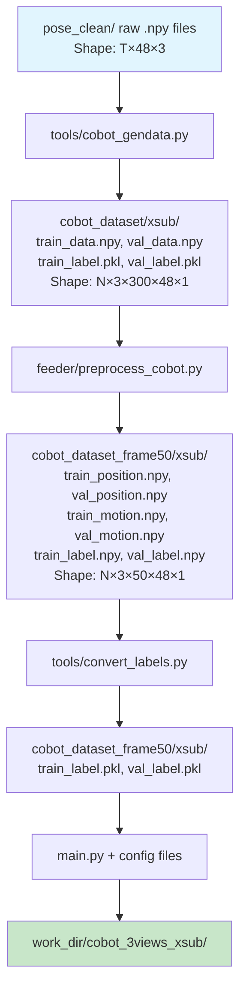
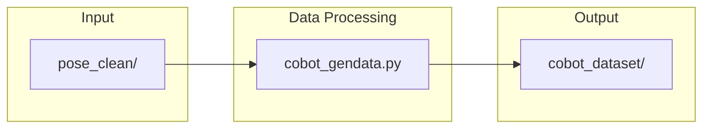
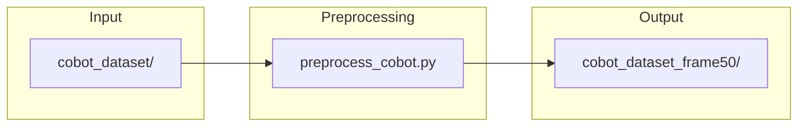
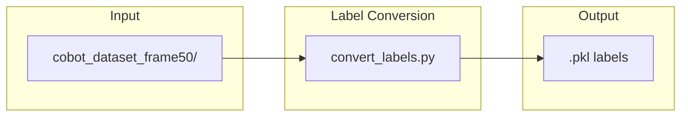
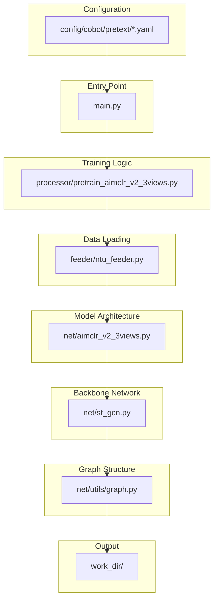
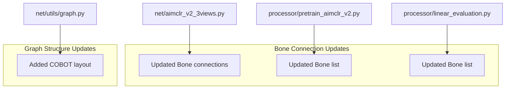
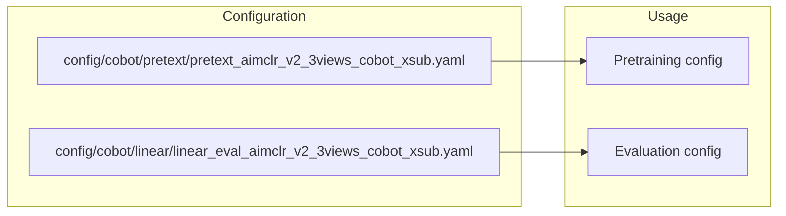
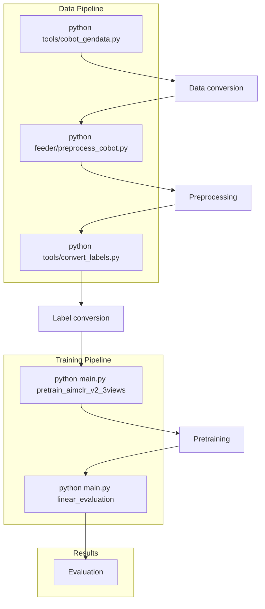
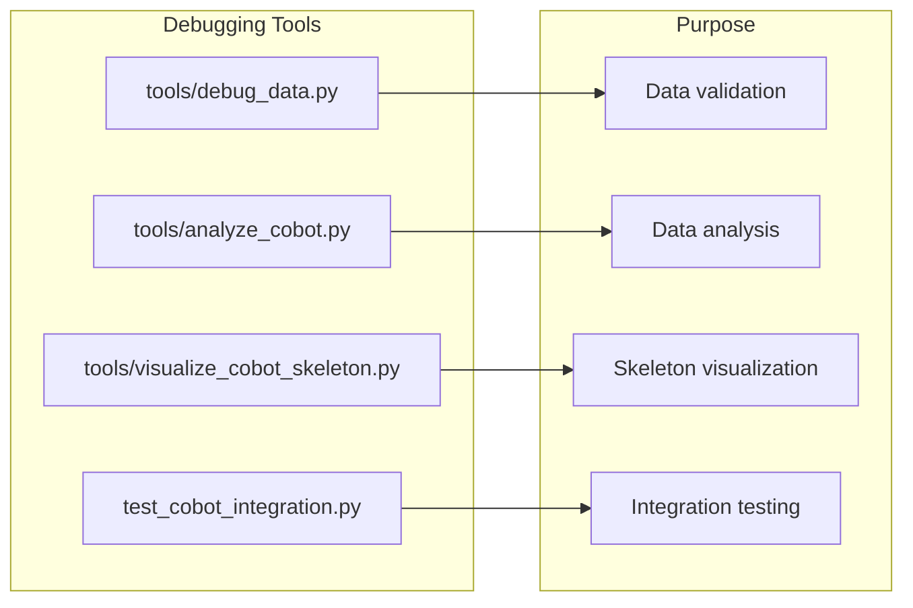

# File Interaction Flowchart for COBOT Integration

## 🔄 Complete Data Flow Pipeline



## 🏗️ Detailed File Dependencies

### **Phase 1: Data Processing**


**File: `tools/cobot_gendata.py`**
- **Input**: `pose_clean/` (raw .npy files)
- **Process**: Converts `(T, 48, 3)` → `(N, 3, 300, 48, 1)`
- **Output**: `cobot_dataset/xsub/` (standardized format)
- **Dependencies**: `numpy`, `open_memmap`

### **Phase 2: Preprocessing**


**File: `feeder/preprocess_cobot.py`**
- **Input**: `cobot_dataset/xsub/`
- **Process**: 
  - Downsample to 50 frames
  - Generate motion data
  - Handle variable lengths
- **Output**: `cobot_dataset_frame50/xsub/`
- **Dependencies**: `NTUDatasets.py`, `torch`, `numpy`

### **Phase 3: Label Conversion**


**File: `tools/convert_labels.py`**
- **Input**: `.npy` label files
- **Process**: Convert to `.pkl` format
- **Output**: `.pkl` label files
- **Dependencies**: `numpy`, `pickle`

### **Phase 4: Training**


## 📊 Data Shape Transformations

### **Raw Data → Standardized**
```
pose_clean/ (raw)
├── Shape: (T, 48, 3) - variable length
└── Format: .npy files

cobot_gendata.py
└── Converts to: (N, 3, 300, 48, 1)
    ├── N = number of samples
    ├── 3 = x,y,z coordinates
    ├── 300 = max frames (padded/cropped)
    ├── 48 = joints
    └── 1 = single person
```

### **Standardized → Preprocessed**
```
cobot_dataset/xsub/
├── Shape: (N, 3, 300, 48, 1)
└── Format: .npy + .pkl

preprocess_cobot.py
└── Converts to: (N, 3, 50, 48, 1)
    ├── Downsampled to 50 frames
    ├── Generated motion data
    └── Handled variable lengths
```

### **Preprocessed → Training Ready**
```
cobot_dataset_frame50/xsub/
├── Position: (N, 3, 50, 48, 1)
├── Motion: (N, 3, 50, 48, 1)
└── Labels: .pkl format

main.py + config
└── Loads into training pipeline
```

## 🔧 Key File Modifications for COBOT

### **Network Architecture Changes**


**Modified Files:**
1. **`net/aimclr_v2_3views.py`**
   - Updated `self.Bone` list for 48 joints
   - Added COBOT-specific bone connections

2. **`net/utils/graph.py`**
   - Added `cobot` layout
   - Defined 48-joint graph structure

3. **`processor/pretrain_aimclr_v2.py`**
   - Updated `Bone` list for bone stream processing

4. **`processor/linear_evaluation.py`**
   - Updated `Bone` list for bone stream processing

### **Configuration Files**


**New Configuration Files:**
- `config/cobot/pretext/pretext_aimclr_v2_3views_cobot_xsub.yaml`
  - Sets `num_class: 3` (COBOT actions)
  - Sets `graph_args.layout: 'cobot'`
  - Adjusted hyperparameters for stability

- `config/cobot/linear/linear_eval_aimclr_v2_3views_cobot_xsub.yaml`
  - Sets `num_class: 3`
  - Sets `graph_args.layout: 'cobot'`

## 🚀 Execution Commands Flow



## 🔍 Debugging Tools Integration



This comprehensive flowchart shows how each file interacts with others, the data transformations at each step, and the complete pipeline from raw data to final results.
